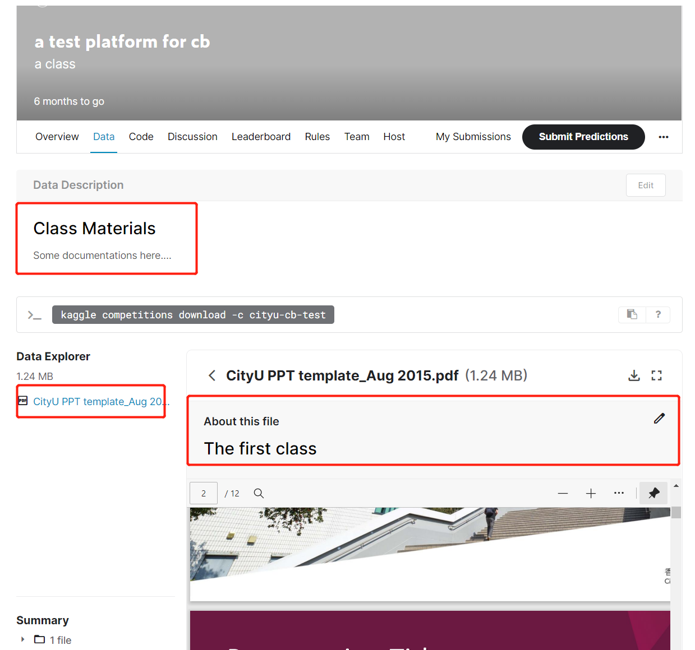

# Class Materials
可以在这里上传一些资料、数据等供学生进行学习、练习。也可以在这里整理汇总一些学习资源。

# Code Running
学生可以直接在新建一个jupyter文件，写code，直接运行得出结果，并且支持**Latex**，非常方便。

# Discussion
可以直接发起讨论的topic，支持code插入，latex插入。别人可以comment。

# Try it out
https://www.kaggle.com/c/cityu-cb-test/overview
