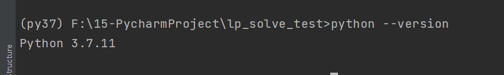
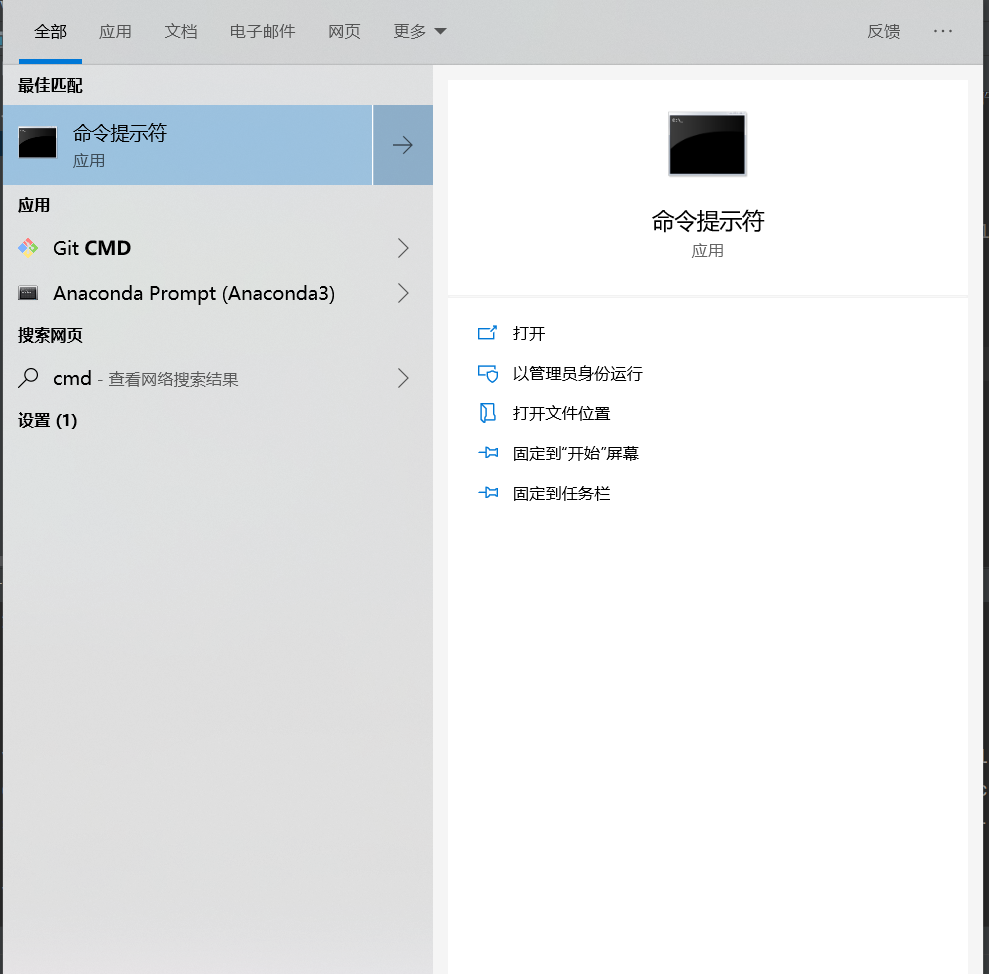
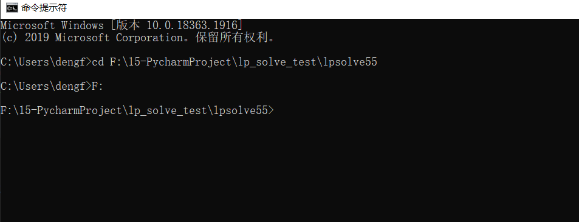
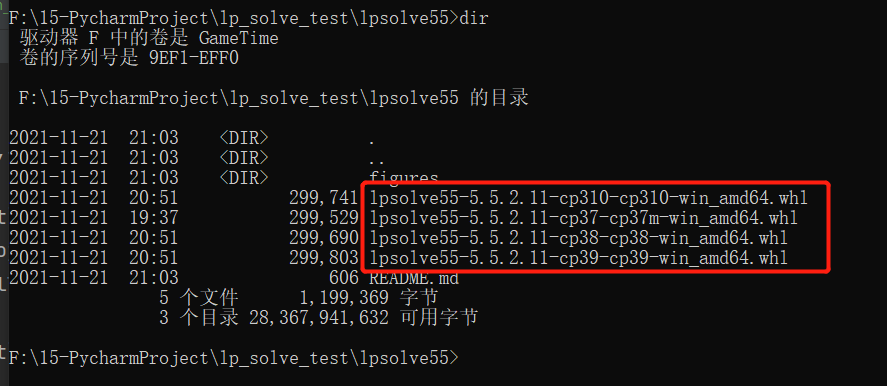
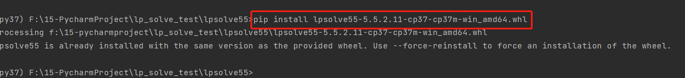

# step 1
首先查看自己python的版本号：

比如我的为python 3.7，那么对应的文件为

- lpsolve55-5.5.2.11-cp37-cp37m-win_amd64.whl

文件名上的`cp37`表示对应的python版本号（3.7），注意要对应安装。最新版本的lpsolve需要在python3.7以上使用。

# step 2
然后在命令行[cmd]下进入`放有lpsolve55安装文件`的文件夹：

# step 3
然后执行安装命令 `pip install lpsolve55-5.5.2.11-cp37-cp37m-win_amd64.whl`：

这样就完成了安装。