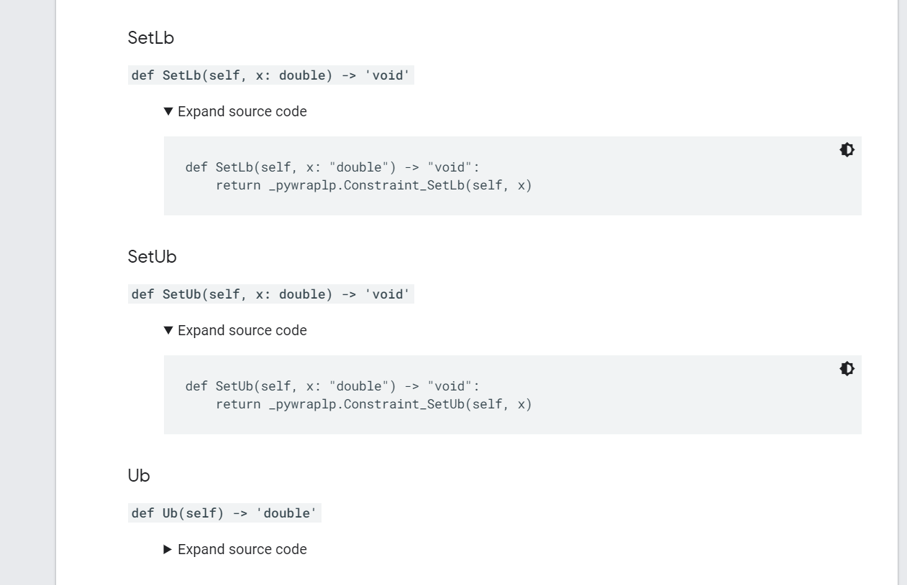

# Computational Experiments

- 由于lpsolve只能使用单线程模式，因此在实验中我限制了CPLEX也只能使用单线程。
- 测试数据集来源于：http://www.netlib.org/lp/data/index.html
- 共测试了91个instances, 其中大多数都可以快速地求解，有个别lpsolve无法求解。
- 列名的含义：
  - variable: 模型中变量的个数。
  - constraint: 模型中约束的个数。
  - non_zero: 约束Ax=b中，矩阵A中非0元素的个数。
  - objective: 问题的目标值。
  - time: 求解所花的时间。
- 总结，90个算例中（平均variable=2524，平均constraint=978，平均non_zero=14763）：
  - cplex能全部解到最优，平均求解时间为0.48s。
  - lpsolve只求得了87个算例的最优解，这87个的平均求解的时间为0.89s。有三个算例在长时间内（大于2000s）无法得出可行解（表中标`NA`的单元格），手动终止了。
  - clp比lpsolve更稳定一点。得出的所有结果和cplex一致，时间上也低于lpsolve。
  - 不同的地方在表格中已经加粗了。

| Name                   | variable | constraint | non_zero | cplex         | time | lpsolve          |  time         | clp             | time         |
|------------------------|----------|------------|----------|---------------|---------|--------------|-----------|--------------|----------|
| MPS_Files/25FV47.SIF   | 1571     | 821        | 10400    | 5501.85       | 0.215   | 5501.85      | 0.469     | 5501.85      | 0.1326   |
| MPS_Files/80BAU3B.SIF  | 9799     | 2262       | 21002    | 987224.19     | 0.226   | 987224.19    | 1.587     | 987224.19    | 0.1033   |
| MPS_Files/ADLITTLE.SIF | 97       | 56         | 383      | 225494.96     | 0.096   | 225494.96    | 0.002     | 225494.96    | 0.0032   |
| MPS_Files/AFIRO.SIF    | 32       | 27         | 83       | -464.75       | 0.094   | -464.75      | 0.001     | -464.75      | 0.002    |
| MPS_Files/AGG2.SIF     | 302      | 516        | 4284     | -20239252.36  | 0.1     | -20239252.36 | 0.009     | -20239252.36 | 0.0057   |
| MPS_Files/AGG3.SIF     | 302      | 516        | 4300     | 10312115.94   | 0.102   | 10312115.94  | 0.009     | 10312115.94  | 0.006    |
| MPS_Files/BANDM.SIF    | 472      | 305        | 2494     | -158.63       | 0.105   | -158.63      | 0.026     | -158.63      | 0.0076   |
| MPS_Files/BEACONFD.SIF | 262      | 173        | 3375     | 33592.49      | 0.097   | 33592.49     | 0.004     | 33592.49     | 0.0034   |
| MPS_Files/BNL1.SIF     | 1175     | 643        | 5121     | 1977.63       | 0.111   | 1977.63      | 0.074     | 1977.63      | 0.0282   |
| MPS_Files/BNL2.SIF     | 3489     | 2324       | 13999    | 1811.24       | 0.157   | 1811.24      | 0.474     | 1811.24      | 0.0465   |
| MPS_Files/BOEING1.SIF  | 384      | 351        | 3485     | -335.21       | 0.107   | -335.21      | 0.022     | -335.21      | 0.0071   |
| MPS_Files/BOEING2.SIF  | 143      | 166        | 1196     | -315.02       | 0.096   | -315.02      | 0.003     | -315.02      | 0.005    |
| MPS_Files/BORE3D.SIF   | 315      | 233        | 1429     | 1373.08       | 0.098   | 1373.08      | 0.005     | 1373.08      | 0.0032   |
| MPS_Files/BRANDY.SIF   | 249      | 220        | 2148     | 1518.51       | 0.1     | 1518.51      | 0.008     | 1518.51      | 0.0059   |
| MPS_Files/CAPRI.SIF    | 353      | 271        | 1767     | 2690.01       | 0.099   | 2690.01      | 0.007     | 2690.01      | 0.0043   |
| MPS_Files/CYCLE.SIF    | 2857     | 1903       | 20720    | -5.23         | 0.136   | -5.23        | 0.474     | -5.23        | 0.022    |
| MPS_Files/CZPROB.SIF   | 3523     | 929        | 10669    | 2185196.70    | 0.142   | 2185196.7    | 0.362     | 2185196.7    | 0.0166   |
| MPS_Files/D2Q06C.SIF   | 5167     | 2171       | 32417    | 122784.21     | 0.792   | 122784.21    | 3.798     | 122784.21    | 0.6881   |
| MPS_Files/D6CUBE.SIF   | 6184     | 415        | 37704    | 315.49        | 0.177   | 315.49       | 0.363     | 315.49       | 0.7749   |
| MPS_Files/DEGEN2.SIF   | 534      | 444        | 3978     | -1435.18      | 0.113   | -1435.18     | 0.08      | -1435.18     | 0.0129   |
| MPS_Files/DEGEN3.SIF   | 1818     | 1503       | 24646    | -987.29       | 0.237   | -987.29      | 1.536     | -987.29      | 0.1393   |
| **MPS_Files/E226.SIF**     | 258      | 159        | 2300     | **-11.64**        | 0.09    | **-25.86**       | 0.013     | **-11.64**       | 0.0073   |
| MPS_Files/ETAMACRO.SIF | 688      | 400        | 2409     | -755.72       | 0.101   | -755.72      | 0.025     | -755.72      | 0.0089   |
| MPS_Files/FFFFF800.SIF | 854      | 524        | 6227     | 555679.56     | 0.105   | 555679.56    | 0.065     | 555679.56    | 0.01     |
| MPS_Files/FINNIS.SIF   | 614      | 497        | 2310     | 172791.07     | 0.102   | 172791.07    | 0.028     | 172791.07    | 0.007    |
| MPS_Files/FIT1D.SIF    | 1026     | 24         | 13404    | -9146.38      | 0.111   | -9146.38     | 0.023     | -9146.38     | 0.0126   |
| MPS_Files/FIT1P.SIF    | 1677     | 627        | 9868     | 9146.38       | 0.137   | 9146.38      | 0.11      | 9146.38      | 0.0288   |
| MPS_Files/FIT2D.SIF    | 10500    | 25         | 129018   | -68464.29     | 1.344   | -68464.29    | 1.015     | -68464.29    | 0.0982   |
| MPS_Files/FIT2P.SIF    | 13525    | 3000       | 50284    | 68464.29      | 1.205   | 68464.29     | 5.442     | 68464.29     | 1.1112   |
| MPS_Files/GANGES.SIF   | 1681     | 1309       | 6912     | -109585.74    | 0.109   | -109585.74   | 0.118     | -109585.74   | 0.0097   |
| MPS_Files/GREENBEA.SIF | 5405     | 2392       | 30877    | -72555248.13  | 0.376   | -72555248.13 | 6.114     | -72555248.13 | 0.1555   |
| MPS_Files/GREENBEB.SIF | 5405     | 2392       | 30877    | -4302260.26   | 0.48    | -4302260.26  | 4.356     | -4302260.26  | 0.3828   |
| MPS_Files/GROW15.SIF   | 645      | 300        | 5620     | -106870941.29 | 0.124   | -106870941.3 | 0.065     | -106870941.3 | 0.0331   |
| MPS_Files/GROW22.SIF   | 946      | 440        | 8252     | -160834336.48 | 0.215   | -160834336.5 | 0.183     | -160834336.5 | 0.0821   |
| MPS_Files/GROW7.SIF    | 301      | 140        | 2612     | -47787811.81  | 0.114   | -47787811.81 | 0.014     | -47787811.81 | 0.0063   |
| MPS_Files/ISRAEL.SIF   | 142      | 174        | 2269     | -896644.82    | 0.087   | -896644.82   | 0.008     | -896644.82   | 0.005    |
| MPS_Files/KB2.SIF      | 41       | 43         | 286      | -1749.90      | 0.094   | -1749.9      | 0.001     | -1749.9      | 0.0017   |
| MPS_Files/LOTFI.SIF    | 308      | 153        | 1078     | -25.26        | 0.097   | -25.26       | 0.006     | -25.26       | 0.0032   |
| MPS_Files/MAROS-R7.SIF | 9408     | 3136       | 144848   | 1497185.17    | 0.809   | 1497185.17   | 5.408     | 1497185.17   | 0.9673   |
| MPS_Files/MAROS.SIF    | 1443     | 846        | 9614     | -58063.74     | 0.121   | -58063.74    | 0.286     | -58063.74    | 0.0331   |
| MPS_Files/MODSZK1.SIF  | 1620     | 687        | 3168     | 320.62        | 0.109   | 320.62       | 0.046     | 320.62       | 0.014    |
| MPS_Files/NESM.SIF     | 2923     | 662        | 13288    | 14076036.49   | 0.213   | 14076036.49  | 0.353     | 14076036.49  | 0.1071   |
| MPS_Files/PEROLD.SIF   | 1376     | 625        | 6018     | -9380.76      | 0.161   | -9380.76     | 0.203     | -9380.76     | 0.2376   |
| MPS_Files/PILOT4.SIF   | 1000     | 410        | 5141     | -2581.14      | 0.144   | -2581.14     | 0.078     | -2581.14     | 0.0333   |
| MPS_Files/PILOT87.SIF  | 4883     | 2030       | 73152    | 301.71        | 5.784   | **NA**           | 2188.029  | 301.71       | 3.5321   |
| MPS_Files/PILOT-JA.SIF | 1988     | 940        | 14698    | -6113.14      | 0.249   | -6113.14     | 0.464     | -6113.14     | 0.4968   |
| MPS_Files/PILOTNOV.SIF | 2172     | 975        | 13057    | -4497.28      | 0.165   | -4497.28     | 0.193     | -4497.28     | 0.1515   |
| MPS_Files/PILOT.SIF    | 3652     | 1441       | 43167    | -557.49       | 0.731   | **NA**           | 12712.605 | -557.49      | 1.1069   |
| MPS_Files/PILOT-WE.SIF | 2789     | 722        | 9126     | -2720107.54   | 0.368   | -2720107.53  | 0.498     | -2720107.54  | 0.1524   |
| MPS_Files/QAP12.SIF    | 8856     | 3192       | 38304    | 522.89        | 1.226   | 522.89       | 151.14    | 522.89       | 28.2218  |
| MPS_Files/QAP15.SIF    | 22275    | 6330       | 94950    | 1040.99       | 17.212  | **NA**           | 2075.136  | 1040.99      | 367.8157 |
| MPS_Files/QAP8.SIF     | 1632     | 912        | 7296     | 203.50        | 0.147   | 203.5        | 1.249     | 203.5        | 0.5776   |
| MPS_Files/RECIPELP.SIF | 180      | 91         | 663      | -266.62       | 0.095   | -266.62      | 0.002     | -266.62      | 0.003    |
| MPS_Files/SC105.SIF    | 103      | 105        | 280      | -52.20        | 0.095   | -52.2        | 0.002     | -52.2        | 0.002    |
| MPS_Files/SC205.SIF    | 203      | 205        | 551      | -52.20        | 0.096   | -52.2        | 0.005     | -52.2        | 0.0035   |
| MPS_Files/SC50A.SIF    | 48       | 50         | 130      | -64.58        | 0.082   | -64.58       | 0.001     | -64.58       | 0.0021   |
| MPS_Files/SC50B.SIF    | 48       | 50         | 118      | -70.00        | 0.094   | -70          | 0.001     | -70          | 0.0029   |
| MPS_Files/SCAGR25.SIF  | 500      | 471        | 1554     | -14753433.06  | 0.106   | -14753433.06 | 0.033     | -14753433.06 | 0.005    |
| MPS_Files/SCAGR7.SIF   | 140      | 129        | 420      | -2331389.82   | 0.097   | -2331389.82  | 0.003     | -2331389.82  | 0.0041   |
| MPS_Files/SCFXM1.SIF   | 457      | 330        | 2589     | 18416.76      | 0.108   | 18416.76     | 0.025     | 18416.76     | 0.007    |
| MPS_Files/SCFXM2.SIF   | 914      | 660        | 5183     | 36660.26      | 0.116   | 36660.26     | 0.081     | 36660.26     | 0.0166   |
| MPS_Files/SCFXM3.SIF   | 1371     | 990        | 7777     | 54901.25      | 0.132   | 54901.25     | 0.187     | 54901.25     | 0.0279   |
| MPS_Files/SCORPION.SIF | 358      | 388        | 1426     | 1878.12       | 0.1     | 1878.12      | 0.011     | 1878.12      | 0.004    |
| MPS_Files/SCRS8.SIF    | 1169     | 490        | 3182     | 904.30        | 0.107   | 904.3        | 0.034     | 904.3        | 0.0097   |
| MPS_Files/SCSD1.SIF    | 760      | 77         | 2388     | 8.67          | 0.099   | 8.67         | 0.004     | 8.67         | 0.004    |
| MPS_Files/SCSD6.SIF    | 1350     | 147        | 4316     | 50.50         | 0.107   | 50.5         | 0.022     | 50.5         | 0.0074   |
| MPS_Files/SCSD8.SIF    | 2750     | 397        | 8584     | 905.00        | 0.149   | 905          | 0.126     | 905          | 0.0294   |
| MPS_Files/SCTAP1.SIF   | 480      | 300        | 1692     | 1412.25       | 0.1     | 1412.25      | 0.011     | 1412.25      | 0.005    |
| MPS_Files/SCTAP2.SIF   | 1880     | 1090       | 6714     | 1724.81       | 0.111   | 1724.81      | 0.071     | 1724.81      | 0.0119   |
| MPS_Files/SCTAP3.SIF   | 2480     | 1480       | 8874     | 1424.00       | 0.107   | 1424         | 0.11      | 1424         | 0.015    |
| MPS_Files/SEBA.SIF     | 1028     | 515        | 4352     | 15711.60      | 0.101   | 15711.6      | 0.021     | 15711.6      | 0.0046   |
| MPS_Files/SHARE1B.SIF  | 225      | 117        | 1151     | -76589.32     | 0.097   | -76589.32    | 0.008     | -76589.32    | 0.0045   |
| MPS_Files/SHARE2B.SIF  | 79       | 96         | 694      | -415.73       | 0.102   | -415.73      | 0.002     | -415.73      | 0.003    |
| MPS_Files/SHELL.SIF    | 1775     | 536        | 3556     | 1208825346.00 | 0.099   | 1208825346   | 0.04      | 1208825346   | 0.0088   |
| MPS_Files/SHIP04L.SIF  | 2118     | 402        | 6332     | 1793324.54    | 0.107   | 1793324.54   | 0.043     | 1793324.54   | 0.0099   |
| MPS_Files/SHIP04S.SIF  | 1458     | 402        | 4352     | 1798714.70    | 0.103   | 1798714.7    | 0.032     | 1798714.7    | 0.0073   |
| MPS_Files/SHIP08L.SIF  | 4283     | 778        | 12802    | 1909055.21    | 0.122   | 1909055.21   | 0.132     | 1909055.21   | 0.0171   |
| MPS_Files/SHIP08S.SIF  | 2387     | 778        | 7114     | 1920098.21    | 0.11    | 1920098.21   | 0.069     | 1920098.21   | 0.0098   |
| MPS_Files/SHIP12L.SIF  | 5427     | 1151       | 16170    | 1470187.92    | 0.132   | 1470187.92   | 0.28      | 1470187.92   | 0.0223   |
| MPS_Files/SHIP12S.SIF  | 2763     | 1151       | 8178     | 1489236.13    | 0.121   | 1489236.13   | 0.14      | 1489236.13   | 0.013    |
| MPS_Files/STAIR.SIF    | 467      | 356        | 3856     | -251.27       | 0.114   | -251.27      | 0.033     | -251.27      | 0.0125   |
| MPS_Files/STANDATA.SIF | 1075     | 359        | 3031     | 1257.70       | 0.102   | 1257.7       | 0.005     | 1257.7       | 0.0052   |
| MPS_Files/STANDGUB.SIF | 1184     | 361        | 3139     | 1257.70       | 0.101   | 1257.7       | 0.006     | 1257.7       | 0.0051   |
| MPS_Files/STANDMPS.SIF | 1075     | 467        | 3679     | 1406.02       | 0.104   | 1406.02      | 0.036     | 1406.02      | 0.005    |
| MPS_Files/STOCFOR1.SIF | 111      | 117        | 447      | -41131.98     | 0.099   | -41131.98    | 0.002     | -41131.98    | 0.005    |
| MPS_Files/STOCFOR2.SIF | 2031     | 2157       | 8343     | -39024.41     | 0.137   | -39024.41    | 0.305     | -39024.41    | 0.0258   |
| MPS_Files/STOCFOR3.SIF | 15695    | 16675      | 64875    | -39976.78     | 0.567   | -39976.78    | 21.466    | -39976.78    | 0.4583   |
| MPS_Files/TRUSS.SIF    | 8806     | 1000       | 27836    | 458815.85     | 2.499   | 458815.85    | 1.967     | 458815.85    | 2.3772   |
| MPS_Files/VTP-BASE.SIF | 203      | 198        | 908      | 129831.46     | 0.119   | 129831.46    | 0.003     | 129831.46    | 0.0031   |
| MPS_Files/WOOD1P.SIF   | 2594     | 244        | 70215    | 1.44          | 0.138   | 1.44         | 0.1       | 1.44         | 0.0424   |
| MPS_Files/WOODW.SIF    | 8405     | 1098       | 37474    | 1.30          | 0.158   | 1.3          | 1.127     | 1.3          | 0.1373   |
| Sum                    | 42.863   | 17189.133  | 410.7661 |               |         |              |           |              |          |

# 一些有趣的现象
对于`E226.SIF`这个case，我对比了几个solver，求解结果分别如下：
- 官方报告的optimal: -18.7519
- cplex, gurobi, clp: -11.64
- matlab: -18.7519
- lpsolve: -25.86

会不会是模型解析的问题呢？我把他们的模型打出来看过了，模型都是一样的，只是求解的结果不一样。

至于为什么会这样，我找了一天的资料。看到网上一个比较有趣的回答：

> MIP solvers work with floating-point data. For problems such as yours that have wide variations in the magnitude in the data, this leads to round-off errors. Any LP solver will have to perform operations on this data that can amplify the problem. In some cases like your problem, this can make the solver conclude that the problem is infeasible when it isn't. When you fix variables, the solver does fewer floating point operations.

> the commercial solvers solvers like Gurobi or cplex generally do a better job of working with numerically difficult data like yours. Gurobi has a parameter QuadPrecision that works with higher-precision floating point numbers. Most solvers have a parameter that will make the solver work better with numerically-difficult data. For example LPSolve has a parameter epsint that will make it relax what the it considers an integer. The default for the parameter is 10e-7, so 0.9999999 would be considered to be an integer, but 0.9999998 would not be. You can make this value larger, but you risk receiving unacceptable results.

> You are experiencing a leaky abstrction. Your problem is technically in the scope of Mixed-Integer Programming, but MIP solvers are not designed to solve it. Mixed Integer Programming is an NP-Hard problem. It is impossible to have a solver that works quickly and reliably on all inputs. MIP solvers try to work well on problems that come from diverse areas like portfolio optimization, supply chain planning, and network flows. They aren't designed to solve cryptology problems.

出处：https://stackoverflow.com/questions/16001462/solving-an-integer-linear-program-why-are-solvers-claiming-a-solvable-instance

# 总结
今天看了好几个开源solver的document，得出了一些总结：
- Google-GLOP，对python的支持还在逐渐完善，document并不是很完善，尤其是python的，API甚至没有说明，比如下图中的例子。使用前需要看看提供的API支持能否满足我们的需求。https://developers.google.com/optimization/lp/lp_example

- coin-or的clp: 现在对python的支持好了一点，他们在开发一个包`CyLP`，可以在python中比较方便地使用clp进行求解。文档的说明也全一点，功能还在逐渐完善。https://github.com/coin-or/CyLP
- lp_solve: 说明比较完整，对开发友好一点。http://web.mit.edu/lpsolve/doc/

