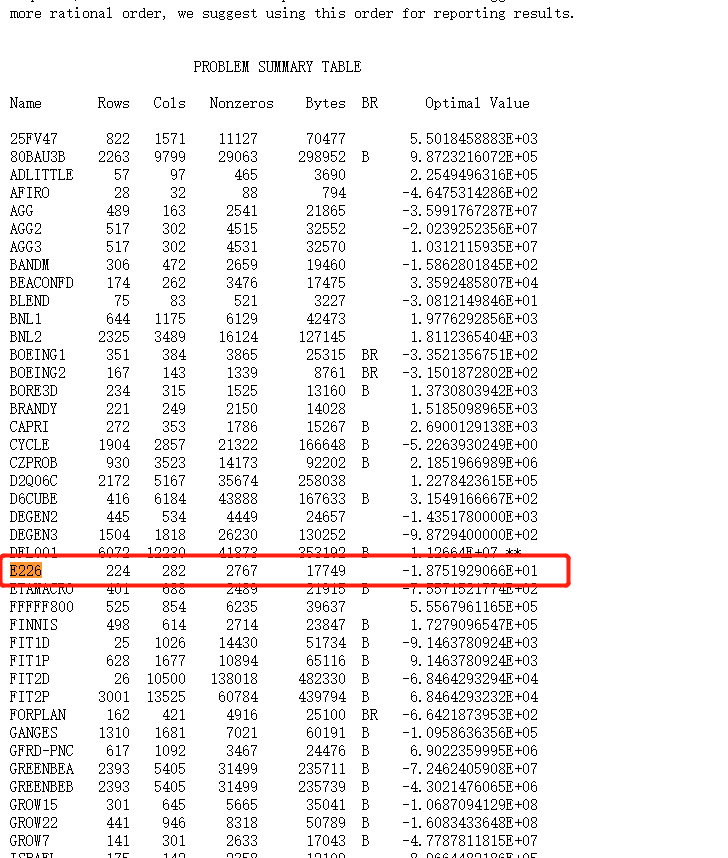

- 同一个问题，CPLEX能解，lpsolve却infeasible？

> MIP solvers work with floating-point data. For problems such as yours that have wide variations in the magnitude in the data, this leads to round-off errors. Any LP solver will have to perform operations on this data that can amplify the problem. In some cases like your problem, this can make the solver conclude that the problem is infeasible when it isn't. When you fix variables, the solver does fewer floating point operations.

> the commercial solvers solvers like Gurobi or cplex generally do a better job of working with numerically difficult data like yours. Gurobi has a parameter QuadPrecision that works with higher-precision floating point numbers. Most solvers have a parameter that will make the solver work better with numerically-difficult data. For example LPSolve has a parameter epsint that will make it relax what the it considers an integer. The default for the parameter is 10e-7, so 0.9999999 would be considered to be an integer, but 0.9999998 would not be. You can make this value larger, but you risk receiving unacceptable results.

> You are experiencing a leaky abstrction. Your problem is technically in the scope of Mixed-Integer Programming, but MIP solvers are not designed to solve it. Mixed Integer Programming is an NP-Hard problem. It is impossible to have a solver that works quickly and reliably on all inputs. MIP solvers try to work well on problems that come from diverse areas like portfolio optimization, supply chain planning, and network flows. They aren't designed to solve cryptology problems.

出处：https://stackoverflow.com/questions/16001462/solving-an-integer-linear-program-why-are-solvers-claiming-a-solvable-instance

